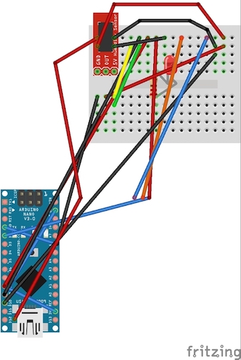
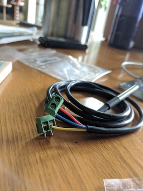

## Assembly

TODO:  updating fritzing diagram to show new diagram with raspberry pi zero instead of Arduino (first crack at this).  This is a big piece of work due to the changing pinouts and how it is mapped on the breadboard.

#### Wiring the Temp and Barometer Sensor (BME280)

As shown in the diagram, this will be a matter of connecting the following with female to female connectors (TODO:  Add link in parts list for these):
From board -> Sensor  
1. GPIO 17 -> VIN  
2. GPIO 6 -> GND  
3. GPIO 3 -> SDI  
4. GPIO 5 -> SCK  

TODO:  Finish up here with a good picture of the breadboard and some more description around the GPIO pins

#### Wiring the Ground Temperature Sensor
The DS1280 doesn't have nicely terminated wiring that we can simply plug into the breadboard.  This is the purpose of the green terminal blocks.  Screw the red and blue wires into one block, and the yellow (on its own) in the 2nd block as seen here.  

The 4.7 KOhm resistor that comes with the DS1280 should be used to jump between the read and yellow wire as seen in the fritzing diagram.  The following wiring should occur:

From board -> Sensor   
1. GPIO 10 -> Power  
2. GND -> GND  
3. GPIO 5 -> DT

#### Wiring the Wind and Rain Sensor
TODO:  Still need some pictures and text of how this is wired after resolving an issue with the sensor

