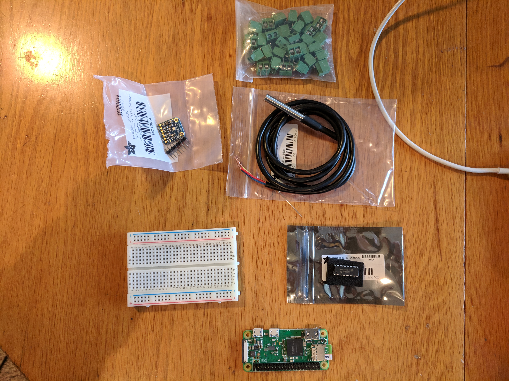

## Hardware

To build a basic weather station we need some hardware.  This can be broken out into two different parts:

* The processor
	* Raspberry Pi [Zero](https://www.adafruit.com/product/3708) with headers.  This is where all of the "smarts" of the project is contained.
* The sensors and support parts
	* [Barometric Pressure](https://www.adafruit.com/product/2652)
	* [Temperature](https://www.adafruit.com/product/381)
	* [Analog to Digital](https://www.adafruit.com/product/856) converter
	* [Micro SD card](https://smile.amazon.com/gp/product/B06XWN9Q99/ref=oh_aui_detailpage_o00_s00?ie=UTF8&psc=1)
	* [PCB mount blocks](https://smile.amazon.com/gp/product/B00EZ3QPCU/ref=oh_aui_detailpage_o01_s00?ie=UTF8&psc=1)
	* [Wind+Rain](https://smile.amazon.com/gp/product/B00QURVHN6/ref=oh_aui_detailpage_o00_s00?ie=UTF8&psc=1)
	* [RJ11 Breakouts](https://smile.amazon.com/gp/product/B01GNO4L6K/ref=oh_aui_detailpage_o01_s00?ie=UTF8&psc=1)
	* [Breadboard](https://www.adafruit.com/product/64)

#### Notes on Raspberry Pi and Headers

The Raspberry Pi Zero with headers is chosen here for cost and simplicity reasons.  The Pi Zero has Wifi built in, and the version linked above has what are called headers, soldered on to the board.  Headers are like an extension cord, and a breadboard is similar to adding a multi-prong outlet to a single outlet.  This allows you to work on your project without doing more complicated things, that may be part of a future lesson, such as soldering.  We can plug in multiple sensors into one breadboard that is in turn connected to the board's headers.

#### Note on sensors
Sensors are the parts of the project that can collect information about a given item.  That item can be temperature, wind, etc.  The sensors linked above provide the basics of a weather monitoring solution.  They will allow temperature, barometric pressure, wind, and rain to be measured as frequently as desired.  These sensors are very singularly focused however, and don't have any intelligence behind them.  The sensors generate data, with it being the job of the Raspberry Pi to collect that data and do something with it.  We will go into the collection process in more detail when we write the program to gather this data.

